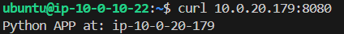

# Multi-Tier-WebApp
This Multi-Tier Web Application created in AWS through Terraform and Ansible. 

## Infra
This project uses Terraform to generate EC2 instances for different applications. 

This project uses a remote backend state file in an S3 instance with a DynamoDB table to ensure all the developers have access to the same file and to also lock the file to prevent multiple changes to be done at once.

The infra has a VPC with public and private subnets in 2 different availability zones. The infra will support a server for each one of the applications in each availability zones. The `Web` server will be accessible by the public through a browser. The `App` server will only be accessible by being in a `Web` server and through the port 8080. The access is limited by the security groups.

To ensure that both availability zone web servers are being used, a load balancer was also created. The load balancer dns is what users will use to go to the application.


## Ansible
Once the infraestructure is generated, we can execute ansible to set up the applications. But first we need to generate a SSH configuration file in order to gain access to the private servers through the Bastion Host.

In the `ansible/` directory execute:
```
./generate_ssh_files.sh <infra_folder> <ssh_key>
```

After that is complete execute whichever of the following commands to set up the corresponding application:

#### Web
To set up the Nginx static web application in the servers with public access use the following command:
```
ansible-playbook -i inventories/web.aws_ec2.yml playbooks/web.yml
```

In order to then access the application open the `alb_dns_name` that was returned by Terraform when create the infra.

If you refresh the page you will see the IP of the application changing.


#### App
To set up the Python application in the private servers use the following command:
```
ansible-playbook -i inventories/app.aws_ec2.yml playbooks/app.yml
```

In order to access the application you have to first ssh into either of the public servers.

Once in the EC2 instance that is hosting a web application execute the following command with a private server IP that is returned by Terraform in the `app_private_ips` section.

```
curl <app_private_ip>:8080
```

You will see the following output:
